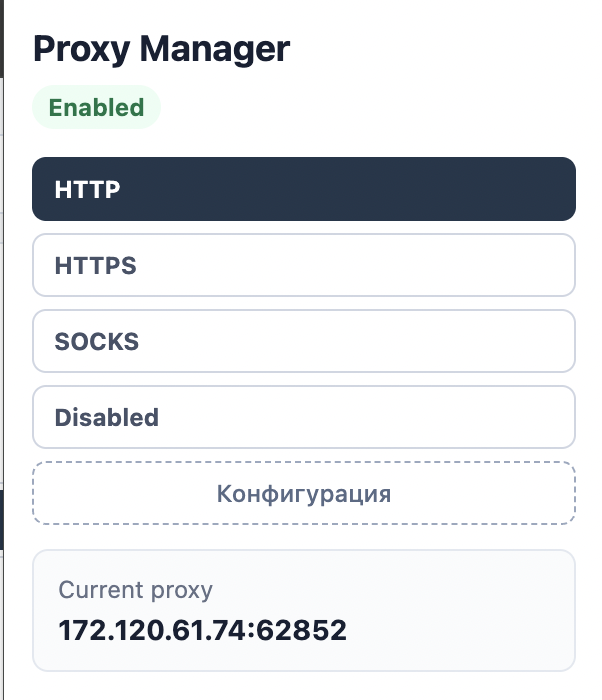
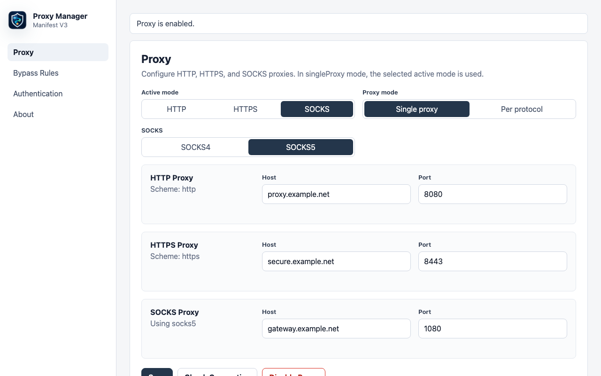

<h1 align="center">Chrome Proxy Manager</h1>

<p align="center">
  A <strong>Manifest V3</strong> Chrome extension for routing traffic through HTTP, HTTPS, or SOCKS proxies.
</p>

<p align="center">
  
  
  
  
</p>

---

## Screenshots

<table>
  <tr>
    <td align="center"><b>Popup</b></td>
    <td align="center"><b>Settings Dashboard</b></td>
  </tr>
  <tr>
    <td></td>
    <td></td>
  </tr>
</table>

## Features

- **Popup** — quickly switch proxy mode (HTTP / HTTPS / SOCKS / Disabled)
- **Settings dashboard** — configure all proxy settings in one place
- **Proxy modes** — `singleProxy` (one active proxy) or `perProtocol` (separate HTTP/HTTPS/SOCKS proxies)
- **SOCKS4 and SOCKS5**
- **Bypass list** — `<local>`, CIDR ranges, wildcard domains, host:port
- **Proxy authentication** — automatically provides credentials through `chrome.webRequest.onAuthRequired`
- **Connection check** — `fetch` to Google's generate_204 endpoint with a timeout
- **JSON import/export** for settings
- **Reset** settings and credentials

## Installation

### From Source

```bash
npm install
npm run build
```

1. Open `chrome://extensions`
2. Enable **Developer mode**
3. Click **Load unpacked**
4. Select the `.output/chrome-mv3` folder

### Development

```bash
npm install
npm run dev        # WXT dev mode with HMR
npm test           # Vitest unit tests
npm run typecheck  # TypeScript checks
npm run build      # Production build
```

## Permissions

| Permission | Purpose |
|---|---|
| `proxy` | Manage proxy settings through `chrome.proxy` |
| `storage` | Store settings and credentials in `chrome.storage.local` |
| `webRequest` | Intercept proxy auth challenges |
| `webRequestAuthProvider` | Respond to auth challenges with credentials |
| `<all_urls>` | Observe auth challenges for proxied requests |

## Tech Stack

- **[WXT](https://wxt.dev/)** — browser extension framework
- **React** + **TypeScript** — UI and type safety
- **Vitest** — unit tests
- **Chrome Manifest V3** — extension APIs

## License

MIT
